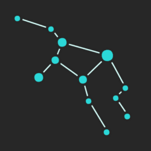

[](http://github.com/badges/stability-badges)



# Astrea Scientific Volume Renderer (Back-End)

This back-end is in an very early stage of development, thankfully the [front-end](https://github.com/AttilaVM/astrea-front-end) exposes all of its functionality without this, except sample saving.

## Use Docker (recommended)

This is the most easiest and stable way to work with Astrea.

``` shell
docker run astrea -p 8000:3000 \
									-e DB_USER=username \
									-e DB_ID=id \
									-e DB_PASS=password \
									-e DB_DIALECT=dialect \
									-e DB_HOST=host

```

It is tested with PoestgreSQL so you are recommend to use it, so you should choode `postgres` dialect.

## Set up mannualy

Clone this repo, install node `v.8` or higher, fill `config.json-example`, then rename it to `config.json`, and start the app with the `app/astrea` script.

# Warnign

You should not use this app on a unsecure network, unless you like to live dangerously, then be my guest.
